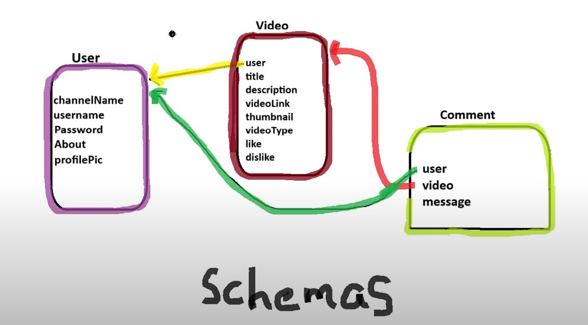

Access the Github repository at - 

https://github.com/sibuspd/YouTubeCloneMERN

## Learnings from Backend Segment 

1. Learnt about FormData() object
2. Utilized Cloudinary Presets 
3. Learnt about Axios
4. Learnt how to use Computed values and properties while dealing with State variables of type Object.
5. CJS and EJS Modules for Backend portion
6. Learnt how Server can be created using Express.js
7. CRUD operations on MongoDB

#### Schemas Used for Backend of YouTube Cone

In Routes folder, R suffix represents a route file.

## Token vs. User Information

##### Token in req.cookies.token:

The token itself contains a payload with limited information, such as userId.

This token is a compact, encoded string that is passed between the client and server to verify the user's identity.

##### Decoded Payload:

When you decode the token using jwt.verify(token, "My_Secret_Key"), you get access to the payload, which typically includes limited information like userId.

##### Fetching User Details:

The decoded token provides the userId, which you then use to fetch the full user details from the database.

This is where await User.findById(decode.userId).select('-password') comes into play. It retrieves the user's information from the database, excluding sensitive fields like the password.

This step ensures that you have the most up-to-date user information, which might include changes made after the token was issued (e.g., profile updates).

#### Reasons for This Process:
##### Security:

The token itself is minimal and doesn't store sensitive information. This minimizes the risk if the token is intercepted.

By fetching user details from the database, you avoid storing sensitive information directly in the token.

##### Dynamic Data:

User information in the database can change over time (e.g., updated profile details, role changes). Fetching the details ensures that you have the latest information.

Tokens typically have a limited lifespan, and during that period, user details might change.

##### Validation:

Decoding the token verifies its authenticity and validity. Only if the token is valid, the corresponding user information is fetched.

This step adds an extra layer of security, ensuring that only authorized users can access certain resources.

#### In Summary:
Token (req.cookies.token): Contains minimal, encoded information.

Decoding (jwt.verify): Extracts the payload, typically with userId.

Database Query (User.findById): Fetches the full, current user details from the database, ensuring accuracy and security.

## bcrypt

**bcrypt.compare()** is used to compare a plain text password with a hashed password. The method returns a boolean value:

true if the plain text password matches the hashed password.

false if the plain text password does not match the hashed password.

## Purpose of the Secret/Private Key:
### Signature Creation:

When creating a JWT, a secret key is used to sign the token. This signature ensures that the token has not been tampered with.

The secret key acts as a shared secret between the server and the client. Only the server knows this key, so it can verify the token's authenticity.

### Signature Verification:

When the client sends the token back to the server (e.g., in an authorization header or cookie), the server uses the same secret key to verify the token's signature.

This verification process confirms that the token was indeed issued by the server and has not been altered.

### Without the Secret/Private Key:
Without the secret key, anyone could create or modify a JWT, compromising the security of your application.

The server would have no reliable way to verify the authenticity and integrity of the token.

## Sign Up Process:
-------------------------------------
| User Submits Sign Up Form         |
|   (channelName, userName, etc.)   |
-------------------------------------
                |
                v
-------------------------------------
| Check if userName Exists          |
-------------------------------------
      |                 |
      | No              | Yes
      v                 v
-------------------------------------
| Encrypt Password using bcrypt     |
-------------------------------------
                |
                v
-------------------------------------
| Create New User Entry             |
-------------------------------------
                |
                v
-------------------------------------
| Save User Entry to Database       |
-------------------------------------
                |
                v
-------------------------------------
| Return Success Message            |
-------------------------------------

## Sign In Process:
-------------------------------------
| User Submits Sign In Form         |
|   (userName, password)            |
-------------------------------------
                |
                v
-------------------------------------
| Find User by userName             |
-------------------------------------
                |
                v
-------------------------------------
| Verify Password with bcrypt       |
-------------------------------------
      |                 |
      | Match           | No Match
      v                 v
-------------------------------------
| Generate JWT Token                |
-------------------------------------
                |
                v
-------------------------------------
| Return Success Message with Token |
-------------------------------------

## Authorization Middleware:
-------------------------------------
| Extract Token from Cookies        |
-------------------------------------
                |
                v
-------------------------------------
| Token Exists?                     |
-------------------------------------
      | Yes             | No
      v                 v
-------------------------------------
| Verify Token using JWT            |
-------------------------------------
                |
                v
-------------------------------------
| Decode Token to Get userId        |
-------------------------------------
                |
                v
-------------------------------------
| Fetch User Details from DB        |
-------------------------------------
                |
                v
-------------------------------------
| Store User Details in req.user    |
-------------------------------------
                |
                v
-------------------------------------
| Proceed to Next Middleware        |
-------------------------------------
